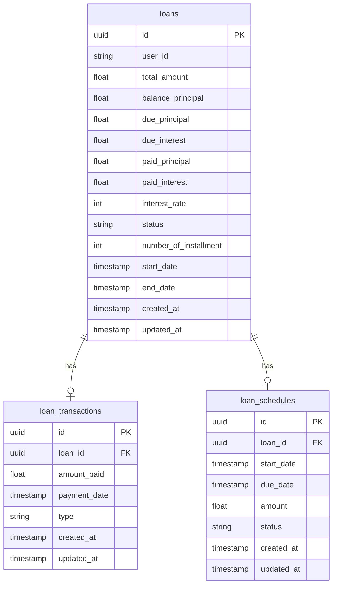
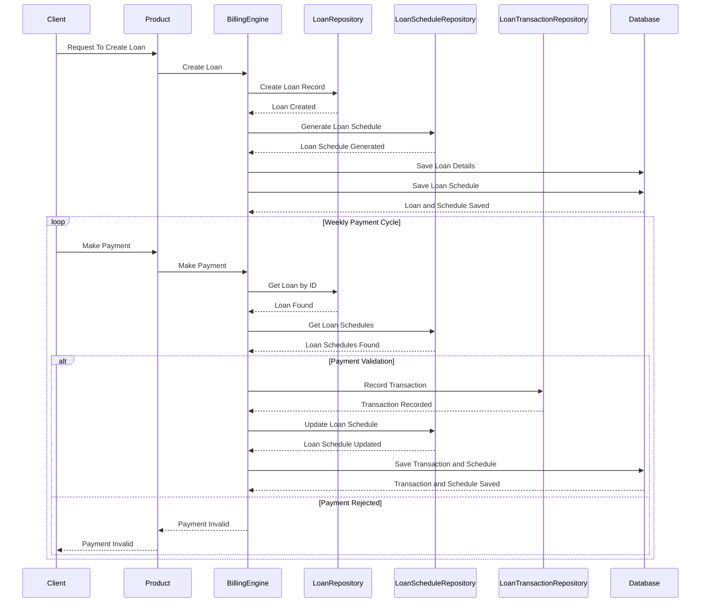

# Billing Engine

## Overview

# Version History

| Version | Description           | PIC           | Date       |
|---------|-----------------------|---------------|------------|
| 1.0     | Initial Documentation | Jafar Rohmadi | 2025-01-31 |

## Entity Relationship Diagram (ERD)

## Sequence Diagrams

### Simple Billing

